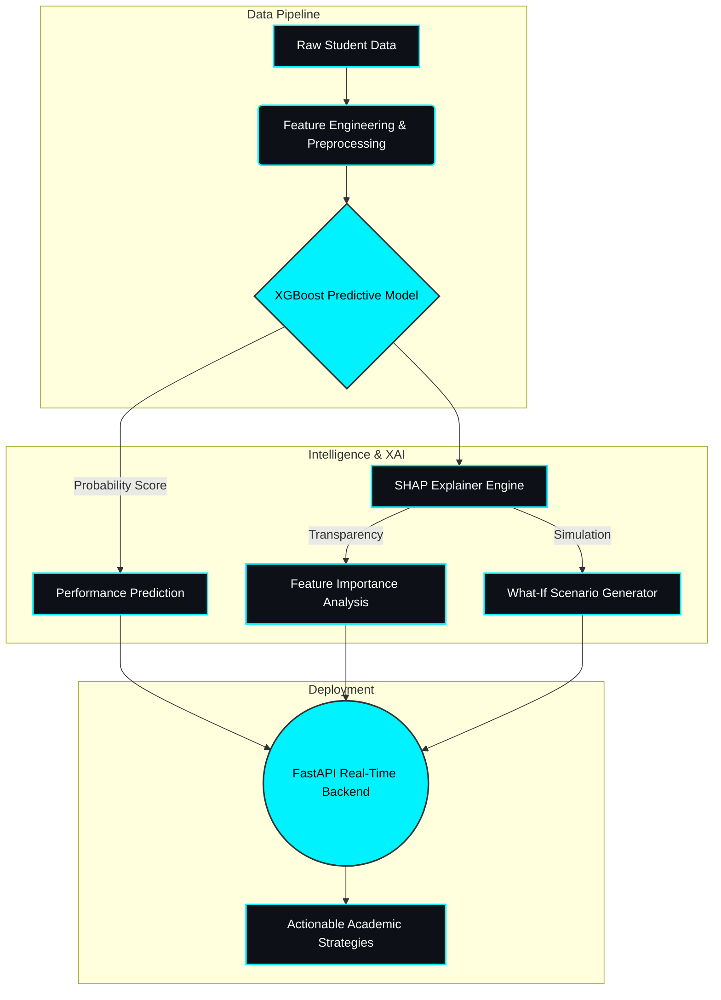

<!-- PROJECT BANNER -->
<div align="center">
  
</div>

<div align="center">
  
  
  
  
  
</div>

<br/>

## 📖 Executive Summary

**EduBuddy** is a robust, end-to-end Machine Learning platform designed to predict student performance, analyze learning trajectories, and generate personalized academic recommendations. Going beyond black-box predictions, EduBuddy leverages **Explainable AI (XAI)** via SHAP to provide educators and students with total transparency into the decision-making process of the model.

---

## 🏗️ System Architecture

The core of EduBuddy relies on a highly optimized XGBoost predictive pipeline connected to a FastAPI backend for real-time inference and simulation.



---

## ⚡ Key Features & Capabilities

*   🎯 **High-Accuracy Predictive Modeling**: Engineered an XGBoost pipeline that achieved **~0.96 ROC-AUC**, effectively identifying at-risk students early in the academic lifecycle.
*   🧠 **Deep Explainability (XAI)**: Integrated `SHAP` (SHapley Additive exPlanations) to break down exactly *why* a prediction was made, offering transparent decision support.
*   🔬 **What-If Simulation Engine**: Allows educators to tweak variables (e.g., "What if the student increases attendance by 10%?") to simulate potential academic outcomes.
*   🚀 **Scalable Microservice Backend**: Fully dockerized and deployed via **FastAPI**, enabling lightning-fast, asynchronous real-time predictions.

---

## 📊 Model Performance Metrics

Rigorous hyperparameter tuning and feature selection were conducted to ensure the model generalizes perfectly to unseen data without overfitting.

| Metric | Score | Impact |
| :--- | :---: | :--- |
| **ROC-AUC** | `0.96` | Excellent capability in distinguishing between student success/failure classifications. |
| **Precision** | `94%+` | Minimal false positives, ensuring interventions are targeted correctly. |
| **Recall** | `92%+` | High sensitivity in catching at-risk students before they fall behind. |

*(Note: Data distributions and precise classification reports are available in the `notebooks/` directory).*

---

## 💻 Quick Start & Installation

To run the EduBuddy FastAPI backend and inference engine locally:

**1. Clone the repository**
```bash
git clone https://github.com/AnsariHuzaif97/EduBuddy-Analytics.git
cd EduBuddy-Analytics
```

**2. Install dependencies**
```bash
pip install -r requirements.txt
```

**3. Boot the FastAPI Server**
```bash
uvicorn app.main:app --reload
```
*The API will be live at `http://localhost:8000`. Navigate to `http://localhost:8000/docs` to view the interactive Swagger UI.*

---

## 🔮 Future Roadmap
- [ ] Migrate data storage to PostgreSQL.
- [ ] Build a React.js / Next.js frontend dashboard for the FastAPI backend.
- [ ] Integrate deep learning sequence models (LSTM) for time-series attendance tracking.

<div align="center">
  <b>Built by Md Huzaifa Ansari</b><br>
  <i>Top 1.98% Kaggle Expert | ML Engineer</i>
</div>
